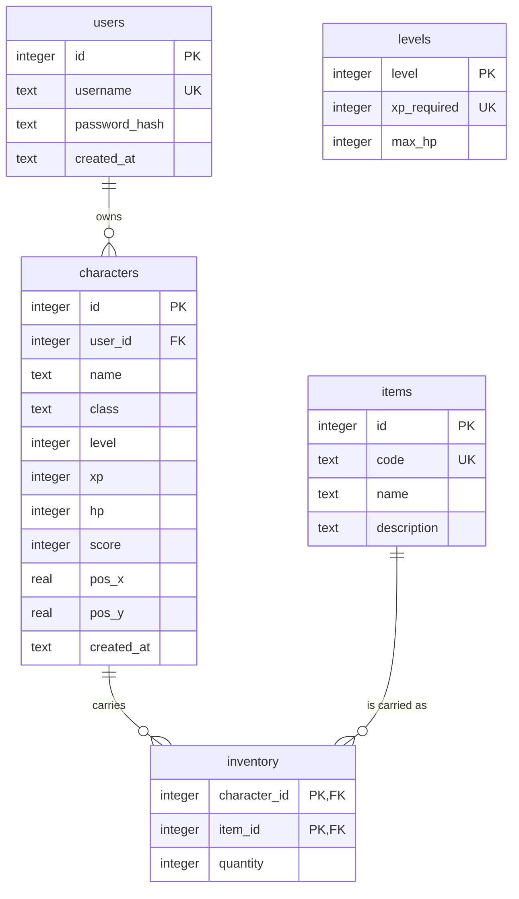

# Database schema

```mermaid
erDiagram
  users ||--o{ characters : owns
  characters ||--o{ inventory : carries
  items ||--o{ inventory : "is carried as"

  users {
      integer id PK
      text username UK
      text password_hash
      text created_at
  }
  characters {
      integer id PK
      integer user_id FK
      text name
      text class
      integer level
      integer xp
      integer hp
      integer score
      real pos_x
      real pos_y
      text created_at
  }
  items {
    integer id PK
    text code UK
    text name
    text description
  }
  inventory {
    integer character_id PK, FK
    integer item_id PK, FK
    integer quantity
  }
  levels {
    integer level PK
    integer xp_required UK
    integer max_hp
  }
```

`levels` stands alone: it is the XP table, read once at startup. Sessions,
rate-limit counters and the leaderboard index live in Redis, not here.
